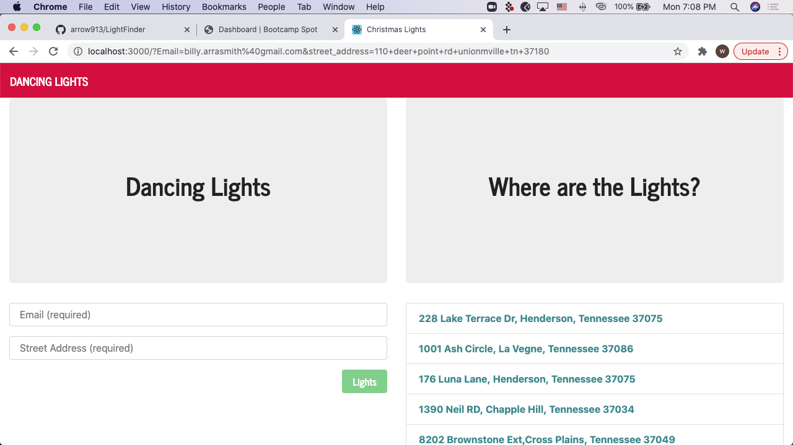

# LightFinder
 
# Overveiw

This app was built to track and add to personal Christmas Lights .It allows users to look up houses near by. 
on Google Maps , it also allows users to add their favorite places to look at lights.

# Process 

React: for the front end.
Mongoose: for the backend.
Deployed: Heroku.

# Created by

William Arrasmith.

